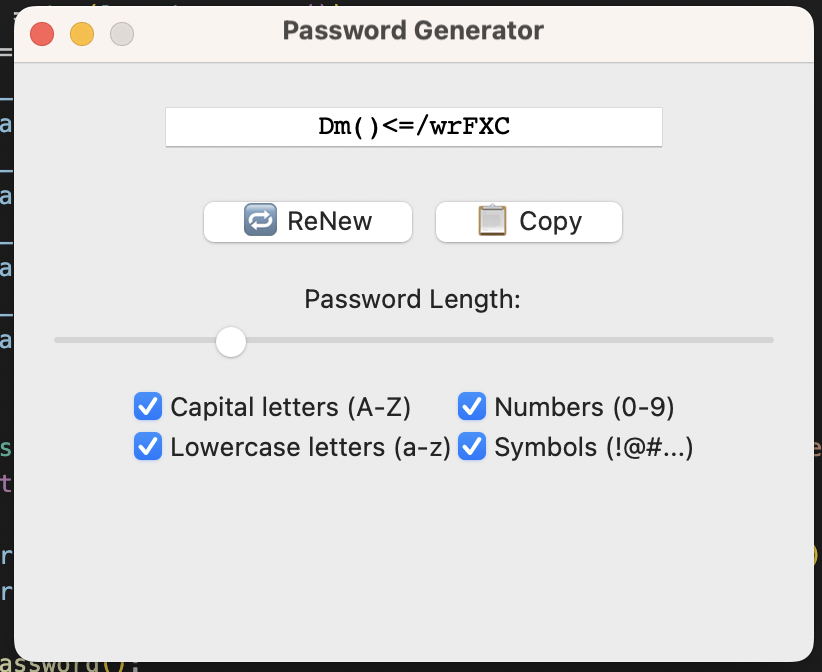

# 🔐 Password Generator GUI (Python)

Effortlessly generate secure passwords with a stylish and user-friendly graphical interface.

✅ Built with `Tkinter`  
✅ Includes copy & renew buttons  
✅ Customizable length and character types  
✅ Minimalist and intuitive UI design

---

## 🖼 Preview

> 📸 Screenshot of the app interface:


---

## 🚀 Features

- Generate strong, random passwords instantly
- Choose character types:
  - Uppercase letters (A–Z)
  - Lowercase letters (a–z)
  - Digits (0–9)
  - Symbols (!@#$...)
- Set desired password length using a slider
- Copy password to clipboard with one click
- Fully responsive and beginner-friendly

---

## 📦 Requirements

Make sure you have Python 3 installed.

Install the required packages using pip:

```bash
pip install pyperclip
```

`tkinter` is included with most standard Python distributions, so no extra installation is usually required.

---

## ▶️ How to Run

1. Download or clone this repository:
```bash
git clone https://github.com/mostafabaghi/password-generator-py.git
cd password-generator-py
```

2. Run the application:
```bash
python main.py
```

That's it! Enjoy generating secure passwords in seconds!

---

## 📚 Tech Stack

- [Python 3](https://www.python.org/)
- [Tkinter GUI Toolkit](https://docs.python.org/3/library/tkinter.html)
- [pyperclip](https://pypi.org/project/pyperclip/) for clipboard support

---

## ✨ Ideal For:

- Developers needing quick, secure passwords
- Portfolio projects to showcase Python GUI skills
- Anyone learning Python and Tkinter

---

## 🔖 License

This project is licensed under the [MIT License](LICENSE).

---

> 💡 Tip: Want to turn this into a web app or mobile app? Fork this project and start building!